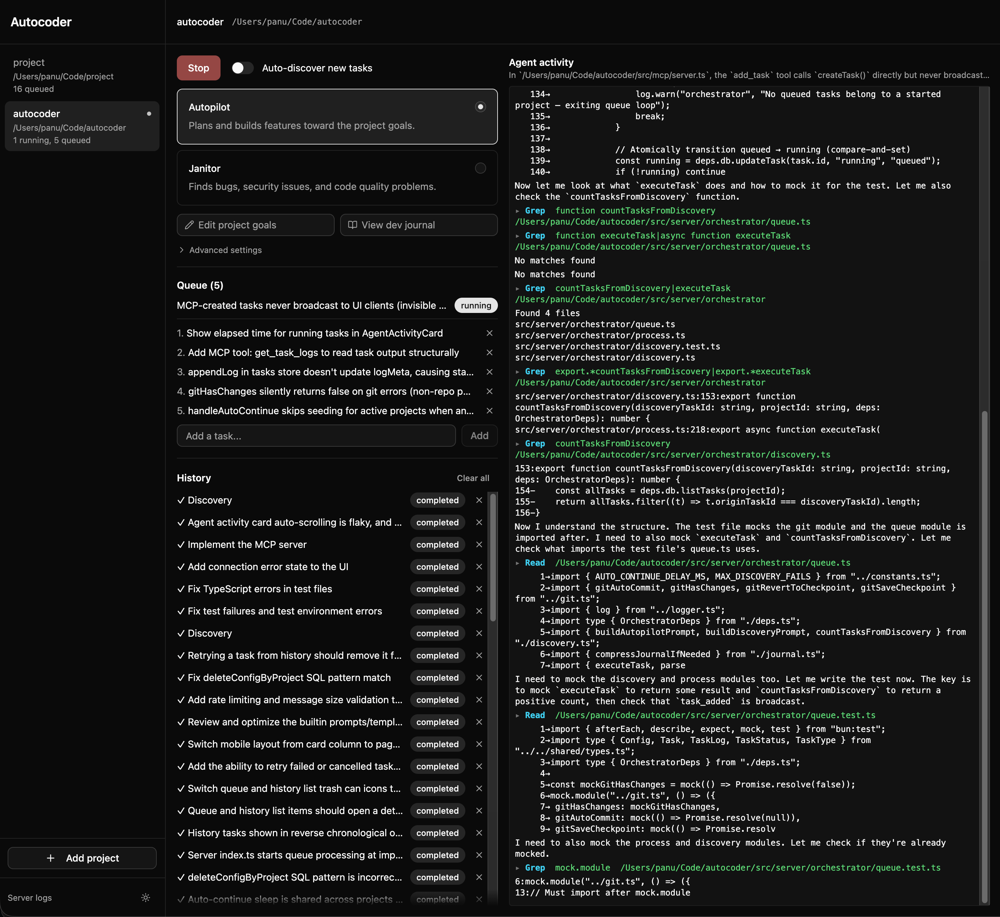

# Autocoder

Local autonomous coding agent orchestrator. Runs a continuous loop where Claude analyzes a target codebase for issues, then implements fixes one by one.

**Discover** — Claude scans for bugs, security issues, missing error handling, and code quality problems  
**Execute** — each discovered issue is queued and fixed sequentially  
**Auto-continue** — optionally repeats the cycle when the queue empties  

A web dashboard provides real-time control and monitoring.

## Tech stack

- **Runtime**: Bun (server, bundler, test runner)
- **Backend**: Bun.serve + WebSocket + SQLite (bun:sqlite)
- **Frontend**: React 19, Zustand, TailwindCSS, shadcn/ui, TanStack Router
- **Agent**: Claude CLI via `Bun.spawn()` with streaming JSON output

## Getting started

```bash
bun install
bun dev
```

Open `http://localhost:4000`, add a project path, and click "Start discovery".

## Scripts

| Command | Description |
| --- | --- |
| `bun dev` | Development server with HMR |
| `bun start` | Production start |
| `bun check` | Biome lint & format |
| `bun typecheck` | TypeScript type checking |
| `bun test` | Run tests |

## Architecture

```
src/
├── server/       Bun.serve, SQLite, WebSocket handler, orchestrator
├── client/       React dashboard (components, stores, routes)
├── shared/       Types, Zod schemas, FSM definitions
└── mcp/          MCP server for external agent integration
```

The server is the single source of truth. All state lives in SQLite and is broadcast to clients over WebSocket. The orchestrator manages Claude subprocesses, parses streaming output, and drives the discover/execute loop.

## UI

Screenshot of Autocoder working on improving itself


